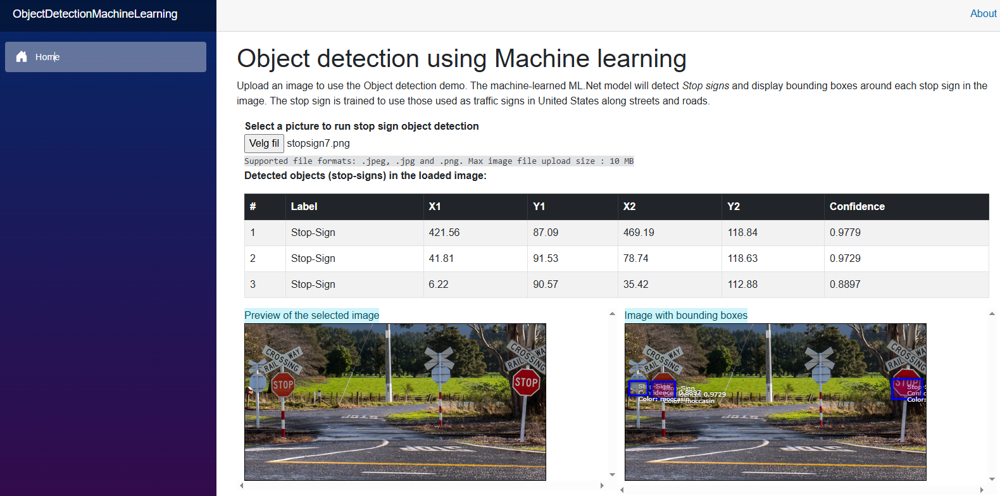

# Object detection using Machine Learning 

This project demonstrates how to implement object detection using machine learning techniques

This solution consists of three projects:

## 1. ObjectDetectionMachineLearning.WEb - Blazor serverside app
The blazor serverside app is the client. It will contact a ML.NET minimal API that will do the number churning
and return the object detection results. The results are then displayed in the browser.

HTML 5 Canvas and Js is used to display the image and bounding boxes of the detected objects.
A summary table is also displayed with the detected objects and their confidence levels.

## StopSignDetection_WebApi1 - ML .NET minimal API
This is the server side of the application. It will load a pre-trained model and use it to detect objects in images.

## Object detection tutorial
This project is based on the [Object detection tutorial](https://learn.microsoft.com/en-us/dotnet/machine-learning/tutorials/object-detection-model-builder) from Microsoft.
Also I have added additional code for the endpoints to upload images and get the object detection results. 